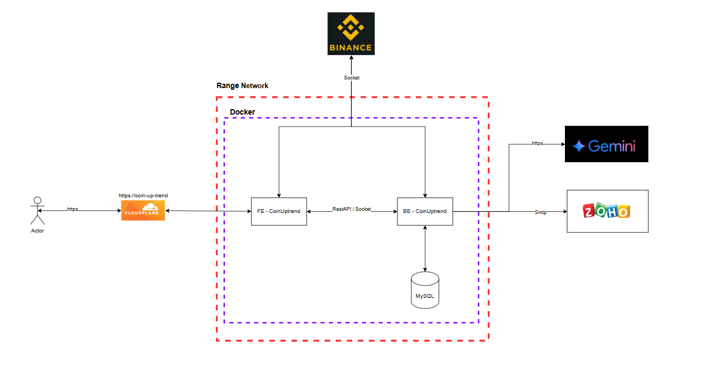
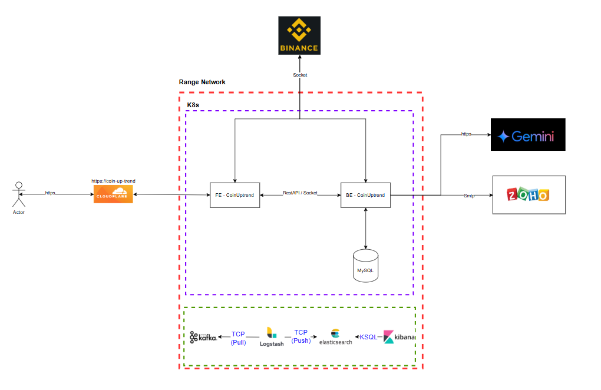
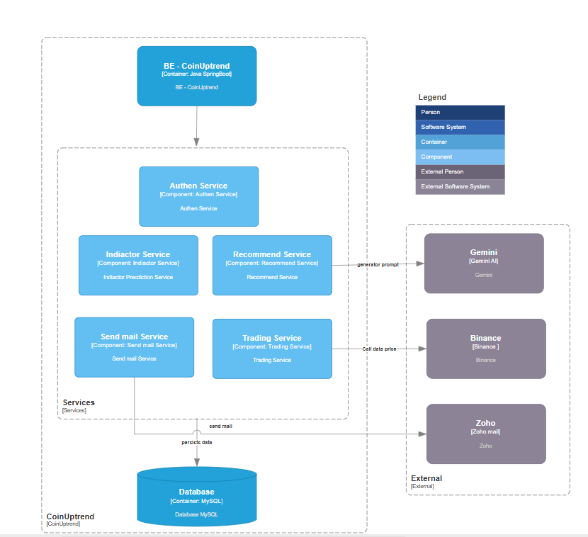

# Tổng quan kiến trúc hệ thống

## Kiến trúc hiện tại:

## Kiến trúc nâng cấp trong tương lai:

# Mô hình C4 của hệ thống

## Level 1. System Context Diagram

## Level 2. Container Diagram

## Level 3. Component Diagram

## Level 4. Code