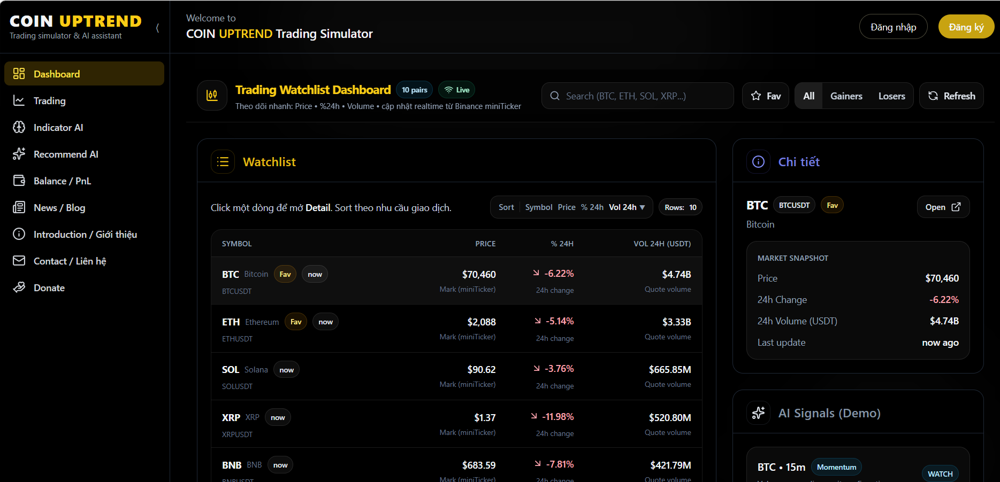
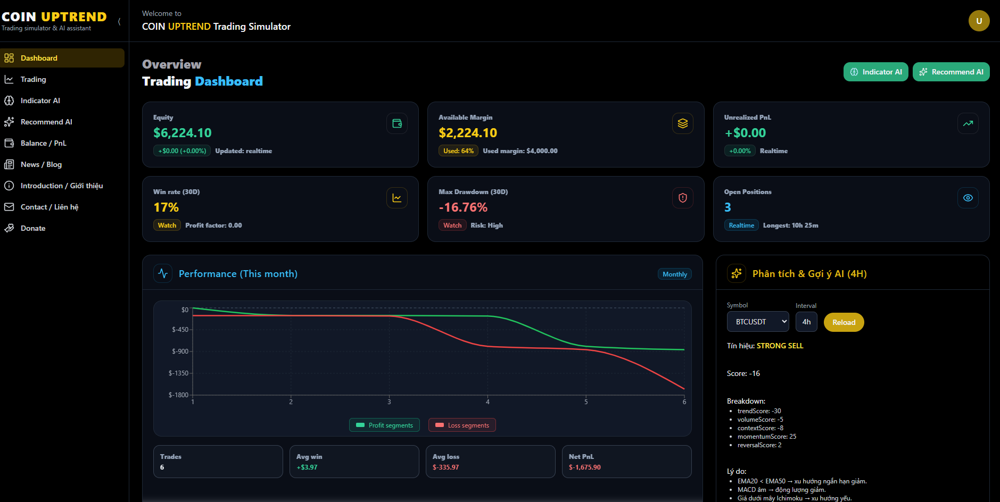
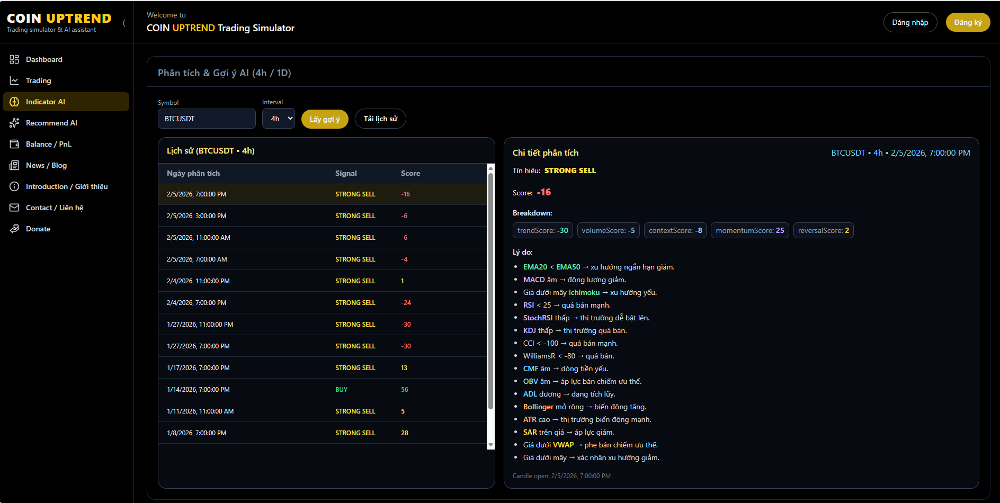
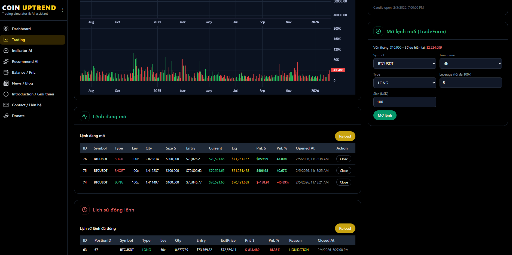
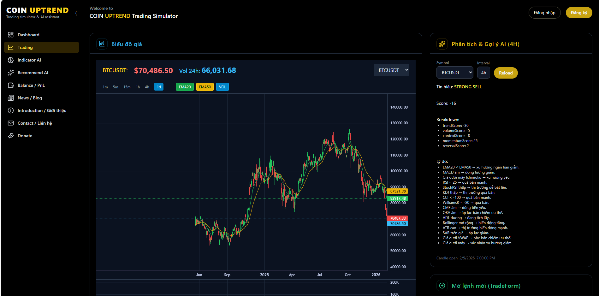

[← Quay lại README chính](README.md) | [🇬🇧 English](README.en.md) | [🏗 Kiến trúc hệ thống](ARCHITECTURE.md)

---
# Coin Uptrend

🌐 **Website:** [https://coin-up-trend.com](https://coin-up-trend.com/)

**Coin Uptrend** là một **Trading simulator & AI assistant** phân tích trực quan giúp người dùng theo dõi giá và xu hướng của các đồng tiền mã hóa chính như Bitcoin, Ethereum, SOL… từ nhiều sàn giao dịch.

---

## 🚀 Tính năng

- 📊 Dashboard bảng giá crypto trực quan
- 🔄 Cập nhật live data bằng WebSocket, có thể Trading simulator 
- 🛠 Dễ triển khai và mở rộng
- 💡 Tương thích với nhiều loại thiết bị

---

## 💻 Công nghệ sử dụng

- **Java 21** cho backend
- **WebSocket** để push dữ liệu real-time
- **ReactJS** cho frontend

---

## 🖥️ Website Demo

